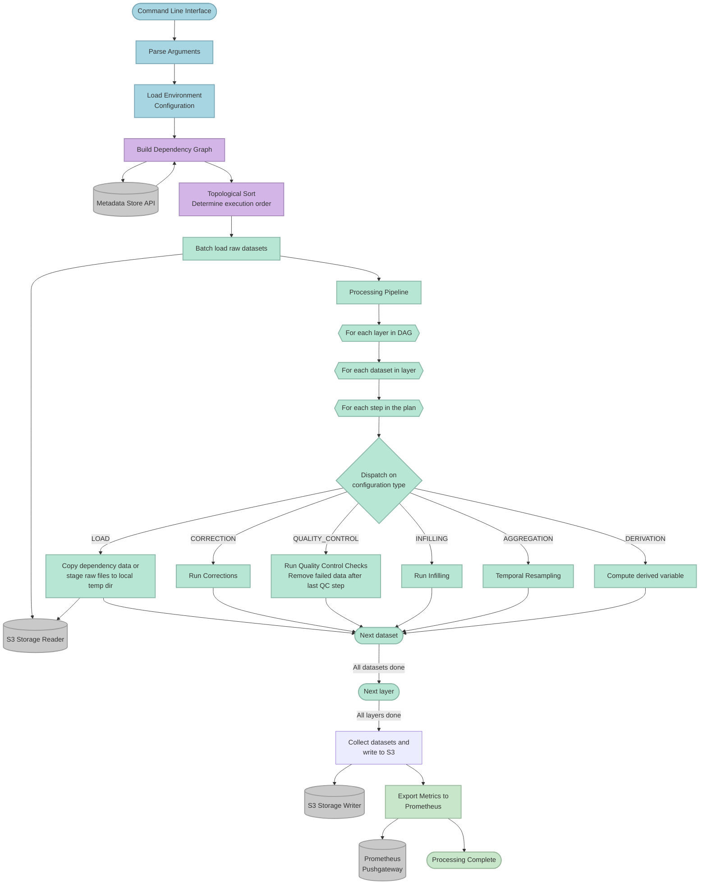
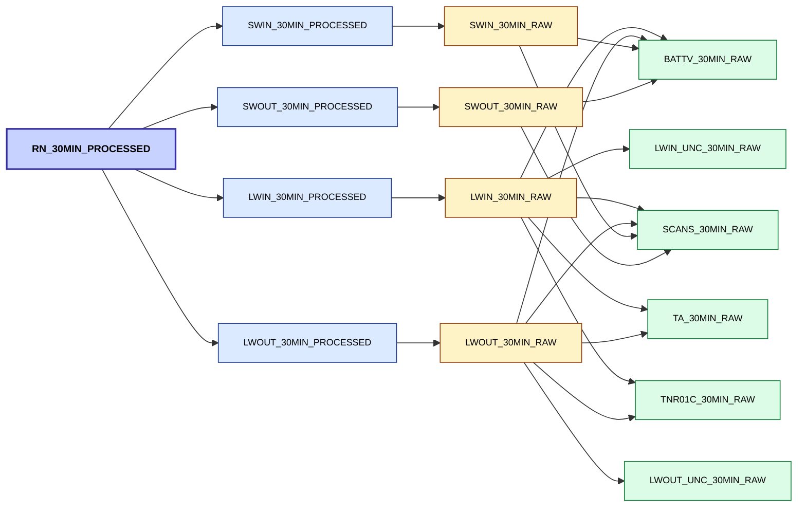

# Architecture Overview

The time series processor follows a metadata-driven, dependency-aware architecture with the several main components,
explained below.

## System Flow Chart




## Core Components

### 1. Command line interface (CLI)

Command line interface supporting three processing modes and one utility command:

- **Explicit mode** (`from-selection`): Fine-grained control over specific site/variable/periodicity combinations
- **Cross-product mode** (`from-cross-product`): Bulk processing across dimensions
- **From-datasets mode** (`from-datasets`): Request datasets directly by metadata API ID - works for both
  `TimeSeriesDataset` and `ObservationDataset` records, and does not require a network argument
- **List-sites**: Output active site IDs for a network as a JSON array

See [CLI Usage](cli_usage.md).

### 2. Environment configuration

The processor is designed to run in multiple execution environments (e.g. local, staging, production), each with
different requirements for specifying credentials, storage paths, and access control. Environment configuration
provides a single abstraction layer that supplies these values to the rest of the system.

The runtime environment is determined from the `environment` environment variable. If omitted, the default is
`LOCAL`.

#### Local Development

- `environment = LOCAL`
- Reads from `__assets__/env.cfg`
- Uses LocalStack for S3 (`endpoint_url` configured)
- Sample data preloaded for testing
- Prometheus metrics pushed locally

#### Staging/Production

- `environment = PRODUCTION, STAGING`
- Reads from environment variables
- Uses AWS S3 directly
- Full dataset access
- Prometheus metrics pushed to gateway

#### Configuration Keys

| Key                   | Purpose                                       | Environments       |
|-----------------------|-----------------------------------------------|--------------------|
| AWS_DEFAULT_REGION    | AWS region for S3 access                      | All                |
| AWS_ACCESS_KEY_ID     | AWS access key (local only uses dummy values) | All                |
| AWS_SECRET_ACCESS_KEY | AWS secret key (local only uses dummy values) | All                |
| level_0_bucket        | S3 bucket containing raw (Level 0) data       | All                |
| processed_bucket      | S3 bucket for processed output data           | All                |
| metadata_api_url      | FDRI metadata API endpoint                    | All                |
| endpoint_url          | S3 endpoint override (LocalStack)             | Local only         |
| pushgateway_url       | Prometheus Pushgateway for metrics            | Staging/Production |

#### Environment Specific Behavior

Different behaviors based on environment:

| Aspect        | Local                        | Staging                 | Production              |
|---------------|------------------------------|-------------------------|-------------------------|
| S3 Access     | LocalStack (localhost:4566)  | AWS S3                  | AWS S3                  |
| Credentials   | Dummy values (test/test)     | IAM role or K8s secrets | IAM role or K8s secrets |
| Data Volume   | Small test dataset           | Full staging data       | Full production data    |
| Metrics       | Local Pushgateway (optional) | Staging Pushgateway     | Production Pushgateway  |
| DuckDB Config | Path-style URLs, no SSL      | Standard AWS config     | Standard AWS config     |

### 3. Metadata Store

All processing decisions are driven by metadata fetched from the FDRI metadata API:

- Dataset definitions and relationships
- A processing **plan** for each dataset - an ordered list of data processing configurations (corrections, QC,
  infilling, aggregation, derivation, load)
- Site metadata (coordinates, altitude, operating periods)
- Dependency chains between datasets

#### API Endpoints Used

```text
 /id/dataset?_view=timeseries
     - Fetch dataset metadata with processing specifications

 /id/data-processing-configuration
     - Fetch correction, QC, infilling, derivation, aggregation configurations

 /id/site/{site_id}
     - Fetch site metadata (location, altitude, etc.)

 /id/site?utilisedBy={programme_uri}/{network}
     - Fetch all sites for a given network

 /id/network/{network_id}
     - Fetch network metadata

```

#### API vs Domain Models

The metadata store returns graph-oriented JSON optimised for semantic relationships and flexible metadata discovery.
The metadata is retrieved from the API into "api models", then is transformed into "domain models" (that reflect
internal processing needs rather than API structure) before it is consumed by the pipeline.

##### API Models

The API models are Pydantic models, designed to extract all the required fields out of the metadata response and
perform validation on types and formats.

##### Domain Models

The API models don't provide "nice" objects to work with in the downstream processes. Field names, datatypes,
and nested structures often need to be resolved and normalised.

Domain models provide a strongly typed internal representation of metadata. These models are designed around the
processor use case, not the API schema. All API models are transformed into a domain model using mapping functions.

### 4. Dependency Graph Builder

The result is a directed acyclic graph (DAG) describing the dependency
relationships between datasets, including raw inputs, intermediate products,
and derived outputs.

Constructs a complete directed acyclic graph (DAG) of dataset dependencies by:

1. Fetching the root (target) datasets. How they are fetched depends on the selection mode:
   - **Dimension-based modes** (`from-selection`, `from-cross-product`): query the metadata API by site,
     variable, and periodicity. If no sites are specified, all sites for the network are fetched first.
     Sites whose operating period does not overlap the requested date window are excluded.
   - **`from-datasets` mode**: fetch datasets directly by ID, with no site pre-filtering.
2. Fetching all relevant data processing configurations (QC, Infill, Correction, Aggregation, Derivation).
3. Resolving dependencies of these data processing configurations.
4. Repeating for any new datasets introduced by these dependencies.

This process produces a complete graph of the state of dependencies, where each node represents a dataset, and
each edge represents a dependency.

The resolver guarantees that the graph is acyclic. If a cycle is detected (e.g., dataset A depends on dataset B which
depends on dataset A), the resolver will fail.

The graph is topologically sorted to ensure dependencies are processed before dependents.

Example visualised for RN:



### 5. Processing Pipeline

The processing pipeline is the core execution engine responsible for transforming raw data into processed data.

The pipeline takes in a dependency graph, representing the datasets to be produced, along with their dependent datasets.
Each dataset is provided as a `TimeSeriesContainer`, which encapsulates:

- dataset loading metadata (e.g. source bucket, column names, etc.)
- its processing **plan** - an ordered list of data processing configurations to apply
- A `TimeFrame` object that holds the actual data for the dataset

The pipeline iterates over all the nodes (datasets) in topological order, ensuring each dataset is processed only
after all its upstream dependencies have been completed and are available in memory.

#### The processing plan

Each dataset carries its own processing plan, built when the dependency graph is constructed. The plan has two parts
on the `TimeSeriesContainer`:

- `plan_order`: an ordered list of configuration IDs, defining the exact sequence steps must run in. The order comes
  from the `index` of each step in the metadata.
- `data_processing_configs`: a dictionary mapping each configuration ID to its `DataProcessingConfig`.

Each `DataProcessingConfig` has a `config_type` (a `ConfigurationType`) that tells the pipeline which operation to run.
The possible types are:

- **LOAD**: Load data into this dataset's container
- **CORRECTION**: Adjust values for known systematic errors
- **QUALITY_CONTROL**: Flag invalid or erroneous values
- **INFILLING**: Fill gaps in the data
- **AGGREGATION**: Resample to a new temporal resolution (e.g. 30 minute to daily)
- **DERIVATION**: Compute a new variable from other datasets (e.g. net radiation from its measured components)

#### Loading data

Before the plan iteration begins, the pipeline loads data for every "load" dataset in one up-front batch
(`_batch_load`). A dataset is treated as a load dataset when it has **no** processing configurations attached -
`TimeSeriesContainer.is_load()` returns `True`. These are the raw inputs at the "leaves" of the dependency graph.

Load datasets are grouped by network, site, resolution and source dataset, so a single query can read all the columns
for a group in one go. Each loaded column is wrapped in a `TimeFrame` and given its initial **core flags**.
Load datasets that are only needed as inputs and are never saved are marked `load_only`.

A `LOAD` step can also appear *inside* a plan, handled by the `LoadPipeline`. This covers two cases:

- `load`: copy a dependency dataset's already-loaded data into this container.
- `load-local-copy`: download raw files to a local temporary directory (used by EddyPro - see
  [Flux / EddyPro](flux_eddypro.md)). The local path is recorded on the container's `staged_dir`.

#### Iterating the plan

For each dataset that is not a load dataset, the pipeline walks `plan_order` in sequence. For each step it looks up the
configuration, then calls the matching operation pipeline based on the configuration type. The output
`TimeFrame` of one step becomes the input to the next, so the data flows through the plan in order.

If any of a dataset's dependencies have failed, the dataset is marked as failed and skipped before any step runs.

#### Quality control data removal

QC operations only **flag** bad values - they do not remove them. The actual removal (setting flagged values to null)
happens once, after the **last** QC step in a contiguous run of QC steps.

The pipeline detects this by looking ahead: after running a QC step it checks the type of the next step in the plan. If
the next step is also QC, removal is deferred; if it is anything else (or the plan has ended), the removal runs. This
means a run of consecutive QC checks all contribute their flags first, and the data is only cut once at the end of that
run - rather than removing data between each individual check.

#### Flag columns and backfilling

Each operation that flags data creates a flag column - but the flag column is only added when that operation actually
runs. A dataset whose plan has no correction step, for example, would never get a corrections flag column.

To keep the flag columns consistent across all datasets, the pipeline runs a **backfill** step after the plan completes
(`_backfill_flag_columns`). This initialises any flag systems and flag columns that were not created during the run, so
every saved dataset ends up with the same set of flag columns regardless of which steps its plan contained. Operations
that do not flag data (aggregation, derivation) are a no-op here. Core flags are already present from loading.

#### Saving strategy - pooling and concurrent saves

To improve performance while processing multiple datasets, instead of saving each dataset individually after it's
processing stage is completed, we instead wait until all datasets have been processed. Then, we can pool together
datasets that we know are going to be saved to the same output parquet file in S3 - i.e. a group of datasets
that have the same network, site ID and resolution. If we imagine we have 20 datasets in a group, this reduces the
number of save actions from 20 down to 1.

Additionally, we have a threading strategy that allows us to run multiple save actions concurrently. This is used
because we save datasets in "per day" parquet files. Imagine a processing run that is processing data for 1 week -
i.e. 7 days, so 7 individual save actions. We know these are being saved to separate locations in S3, so it is
safe to run the save actions concurrently. The mechanism for concurrency is using multiple "threads" rather
than multiple processes. This should work as the save actions are I/O bound rather than CPU bound, so we can kick off
multiple threads within the same shared process.

### 6. I/O Backend

The I/O backend provides a unified interface for reading and writing datasets, isolating the pipeline from
storage formats, storage locations, credential handling, and access protocols. All interaction with object storage
passes through this layer.

#### Reader

The reader component loads dataset data from storage into memory. There are two reader types:

- **`DuckDBParquetReader`**: reads parquet data for a time series dataset by querying a hive-partitioned S3 path
  with DuckDB. Used for batch loading and for `load` steps.
- **`RawFileReader`**: downloads raw files (e.g. `.dat` files) from an S3 prefix into a local temporary directory.
  Used for `load-local-copy` steps, where a subsequent derivation step (such as `EddyProRun`) needs the files on disk.

Both readers are environment-aware. Bucket selection and credentials come from the configuration layer.

#### Writer

The writer component saves completed `TimeFrame` objects back to storage:

- selecting output bucket and prefix (according to environment)
- partitioning data by date, network, site and resolution
- merging new results with existing data when appropriate
- writing parquet files

### 7. Prometheus Metrics

The processor exports metrics to a Pushgateway:

- **Pipeline timing**: Total runtime, per-operation timings
- **Success/failure counts**: Datasets processed successfully or failed
- **Data availability**: Datasets with no data available

Locally accessible at `http://localhost:9091`
