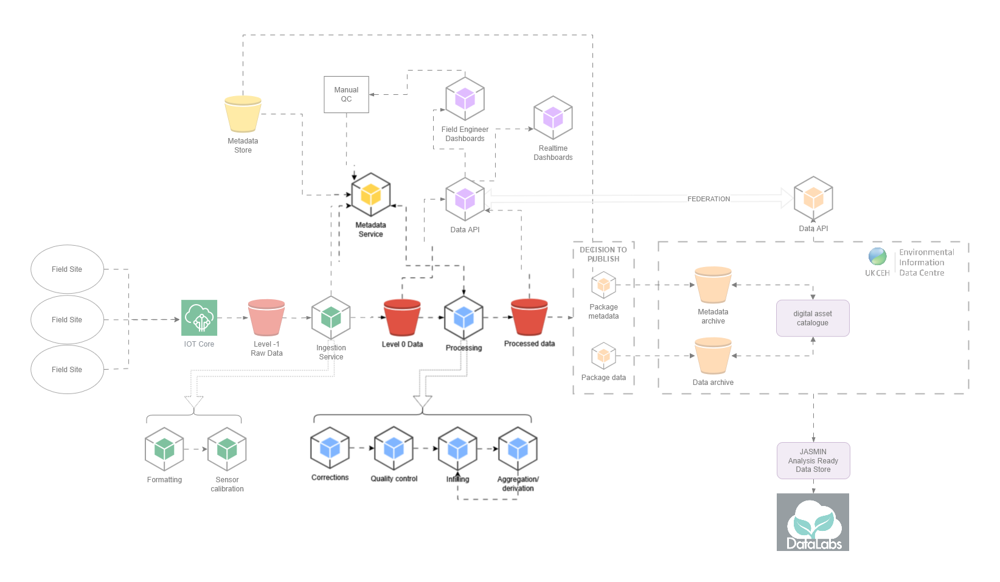

.. _index:

:layout: landing

=====================
Time Series Processor
=====================

The time series processor is a metadata-driven Python application that transforms raw environmental sensor data into
quality-controlled, gap-filled, and derived datasets for the FDRI (Flood and Drought Research Infrastructure) project.

This documentation will provide a higher level overview of the application. For guidance on how to contribute,
see the repository [README](https://github.com/NERC-CEH/dri-timeseries-processor).

Contents
--------

.. toctree::
   :maxdepth: 1
   :caption: User Guide

   user_guide/cli_usage

.. toctree::
   :maxdepth: 1
   :caption: Technical Documentation

   technical/architecture
   technical/operations

.. toctree::
   :maxdepth: 1
   :caption: API Reference

   api/reference